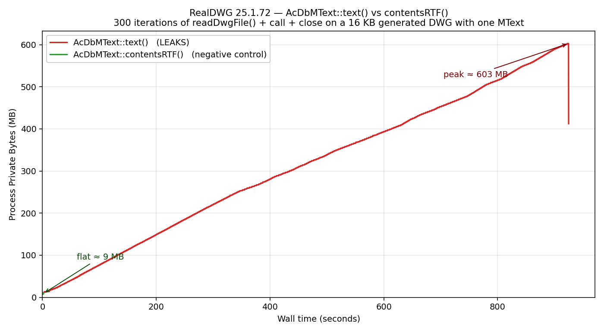

# RealDWG Memory Leak - `AcDbMText::text()` on file-loaded entities (RealDWG 25.1.72)

## Summary

`AcDbMText::text(AcString&)` in RealDWG 25.1.72.0.0 (AutoCAD 2025 SDK) leaks memory
into a RealDWG-internal pool allocator whenever it is called on an `AcDbMText` that
was loaded from a `.dwg` file via `AcDbDatabase::readDwgFile()`. The same call on an
in-memory `AcDbMText` (created via `new AcDbMText()` + `setContents()`) does **not**
leak.

The leaked memory is **not** released by `pEntity->close()`, by destroying the
containing `AcDbDatabase`, or by anything else in the documented entity lifecycle —
only by `acdbCleanUp()` at process shutdown. In a long-lived process (extraction
worker, indexer, conversion service) this accumulates into multi-GB Private Bytes
within minutes.

A single `AcDbMText` in a programmatically generated 16 KB `.dwg` is enough to
reproduce the leak.



## Environment

- RealDWG 25.1.72.0.0 (AutoCAD 2025 SDK)
- Windows 11 Enterprise (10.0.26200)
- MSVC v14.4 (Visual Studio 2022), C++17
- x64 console application
- Reproduced on both Debug (`/MDd /Od`) and Release (`/MD /O2`)

The leak does not depend on which working DB pattern is used: switching the API call
alone (same file-loaded entity) or switching the entity source alone (same `text()`
call) eliminates the leak.

## Expected Behavior

After the following sequence completes for any iteration `i`:

1. `AcDbDatabase` constructed, `readDwgFile()` opens a `.dwg` with one `AcDbMText`
2. Block table walked, `AcDbMText` entity opened via `getEntity(kForRead)`
3. `mt->text(out)` returns the plain MText content
4. `ent->close()` returns the entity to the database
5. `AcDbDatabase` destructor runs at end of scope

Process Private Bytes return close to the pre-iteration baseline (or at least to a
fixed high-water mark that does not grow with iteration count). This is the
documented ownership model: the database owns its entities; the database destructor
cleans them up.

## Actual Behavior

After each iteration of the sequence above, Private Bytes grow by an amount
proportional to the MText content size, monotonically, with no plateau and no
decrease:

1. `AcDbMText::text()` allocates into a custom RealDWG pool allocator
2. The pool reserves virtual memory in ~16 MB chunks via direct `VirtualAlloc(MEM_RESERVE, 16 MB)`,
   not via Win32 heap APIs (`Heap32ListFirst` lists the same 8 heaps before and after)
3. `ent->close()` does **not** release these allocations
4. The `AcDbDatabase` destructor does **not** release these allocations
5. Memory is only released by `acdbCleanUp()` at process shutdown

Measured at default payload (one 90,000-char formatted MText, 300 iterations):

| Wall time | Private Bytes |
|---:|---:|
|   0 s |   7.5 MB |
|  92 s |  71.2 MB |
| 184 s | 136.8 MB |
| 369 s | 263.3 MB |
| 554 s | 368.5 MB |
| 739 s | 472.8 MB |
| 925 s | **602.8 MB** (peak after 300 iterations) |

| API on the loaded MText        | `text()` (leaks) | `contentsRTF()` (control) |
|--------------------------------|------------------|---------------------------|
| Private Bytes, 300 iterations  | 7.5 -> 602.8 MB  | 8.0 -> 10.0 MB             |
| Wall time, 300 iterations      | 925 s            | 2.2 s                     |

Same loop with `contentsRTF()` instead of `text()`: 300 iterations finish in 2.2 s with
Private Bytes flat at ~10 MB.

## Impact

Any process that calls `AcDbMText::text()` on file-loaded MText entities in a loop
(content extraction, indexing, conversion, search) will exhaust memory in proportion
to total MText content processed, with no way to release that memory short of
restarting the process. Typical observed accumulation: ~2 MB per `text()` call on a
90,000-char formatted MText; ~150 KB on a 4,500-char formatted MText; ~45 KB on a
4,500-char plain MText.

## Reproduction

### Prerequisites

- RealDWG 25.1.72.0.0 SDK (AutoCAD 2025 SDK)
- Visual Studio 2022 (any edition; the build script auto-locates it via `vswhere`)
- A Windows machine with a registered RealDWG host application. The repro program
  uses the machine's RealDWG registry root key — pass it as the first argument when
  running the exe (see [Run](#run))

### Build

Standard SDK layout (single root with `inc/` and `lib/`):

```
src\build.bat "C:\path\to\RealDWG-SDK-root"
```

Or, when headers and import libraries live in unrelated directory trees (e.g.
integrated build context), override the paths via environment variables:

```
set INCDIR=C:\path\to\headers
set LIBDIR=C:\path\to\libs
src\build.bat
```

Output: `build\helloworld.exe`.

### Run

1. Copy `build\helloworld.exe` (and `helloworld.pdb`) next to `acdb25.dll`
2. From that directory, run:

```
set MODE=writeread
helloworld.exe "<your-RealDWG-registry-root-key>" 30
```

`MODE=writeread` generates a temporary 16 KB `.dwg` containing one `AcDbMText`,
then runs the read-and-`text()` loop on it. The repro program controls every byte
of the input — no external `.dwg` file is needed.

3. From a second shell, sample memory while the loop runs:

```
.\scripts\run_with_metering.ps1 `
    -ExePath "C:\Program Files\<vendor>\...\helloworld.exe" `
    -RegKey  "<your-RealDWG-registry-root-key>" `
    -Iterations 30 `
    -Tag baseline
```

The script samples `Process.PrivateMemorySize64` every 200 ms and writes a time-series
CSV.

### Sample output

Default payload, 30 iterations of `text()` on a file-loaded MText:

```
=== [baseline] ===
Iterations:        30
Wall time s:       102.8
First Private MB:  7.5
Peak  Private MB:  69.7
Last  Private MB:  69.7
```

Same loop with `USE_RTF=1` (`contentsRTF()` instead of `text()`):

```
=== [rtf] ===
Iterations:        300
Wall time s:       2.5
First Private MB:  8.0
Peak  Private MB:  10.0
Last  Private MB:  9.4
```

## What's been ruled out

- **Not the test code.** All entity ownership follows the documented pattern
  (`getEntity` → `close` → `AcDbDatabase` destructor). Replacing `text()` with a no-op
  stub eliminates the leak entirely while leaving the rest of the loop identical.
  The `MODE=newentity` / `newdb` variants of the repro program create a new in-memory
  `AcDbMText` per iteration with the same content and call `text()` on it — and do
  not leak.
- **Not the file content.** Every measurement in this repo uses a `.dwg` generated
  by the repro program itself (`MODE=writeread`). Every byte is controlled by the
  test code: single `AcDbMText`, no extension dictionaries, no x-data, no external
  font references.
- **Not missing fonts.** The host's `findFile()` callback is instrumented to log
  every lookup. During `text()` calls there are zero font lookups (`.shx` or `.ttf`).
  All asset resolution happens during the first `readDwgFile()` and is OS-loader-cached
  after that. See `evidence/findfile_log.txt`.
- **Not missing support files.** `MTEXTMAP.INI` placed in the RealDWG directory does
  not change leak magnitude. The other missing files reported by `findFile()`
  (`AcDgnIO.dbx`, `AeccImageAssetsRes.dll`) are Civil 3D / DGN xref extensions
  unrelated to MText.
- **Not a buffer overflow.** Growth is monotonic and proportional, with no crashes
  and no heap corruption. The allocation pattern (16 MB chunks via `VirtualAlloc`) is
  not consistent with an overflow.

## Workaround

`AcDbMText::contentsRTF(AcString&)` returns the same content (RTF-encoded) on the
same entities through a different internal code path in `acdb25.dll` and does **not**
trigger the leak. Switching from `text()` to `contentsRTF()` plus stripping the RTF
codes downstream keeps Private Bytes flat over 300 iterations (10 MB peak vs 602.8 MB
with `text()`).

The repro program supports `USE_RTF=1` as an env var to swap the calls without code
changes — see [Sample output](#sample-output) above.

## Files

| File                            | Description                                                       |
|---------------------------------|-------------------------------------------------------------------|
| `src/helloworld.cpp`            | Self-contained ~280-line repro (5 modes + `USE_RTF` toggle)       |
| `src/build.bat`                 | Build script; accepts SDK root or `INCDIR`/`LIBDIR` env override  |
| `scripts/run_with_metering.ps1` | Launches the exe and samples `PrivateMemorySize64` every 200 ms   |
| `scripts/dump_regions.ps1`      | `VirtualQueryEx` snapshot grouped by `AllocationBase`             |
| `scripts/dump_heaps.ps1`        | `Heap32List` enumeration (Win32 heaps only)                       |
| `scripts/plot_leak.py`          | Regenerates `evidence/leak_vs_control.png` from the two CSVs      |

## Evidence

See [`evidence/`](evidence/) for all measurement data:

- `leak_vs_control.png` — headline chart (`text()` vs `contentsRTF()` on the same loop)
- `run_leak_300iter.csv` — Private Bytes time series, 300 iterations of `text()` (4,267 samples)
- `run_rtf_300iter.csv` — same loop with `contentsRTF()` (negative control)
- `size_sweep.csv` — per-call leak magnitude vs MText content size (plain vs formatted)
- `regions_hello_before.csv`, `regions_hello_after.csv` — `VirtualQueryEx` snapshots
  showing the pool segments that appear after the loop
- `heaps_before.csv`, `heaps_after.csv` — `Heap32List` snapshots (same 8 OS heaps in
  both, confirming the pool segments are not Win32 heaps)
- `findfile_log.txt` — every `findFile()` call during 3 iterations (proves no font
  lookups happen during `text()`)

## Questions for Autodesk

1. Is `AcDbMText::text()` documented to allocate into a process-lifetime cache that
   survives entity and database destruction?
2. If yes, what is the supported API for releasing it without calling `acdbCleanUp()`
   (which terminates the entire RealDWG host and forces full re-initialization)?
3. If no, is this a regression vs earlier RealDWG releases, and what is the planned
   fix?
4. Why does `AcDbMText::contentsRTF()` on the same entity not trigger the same leak?
   Is the divergence between the two code paths intentional?
